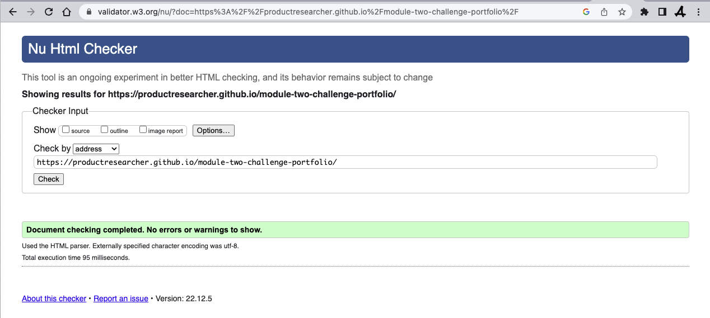
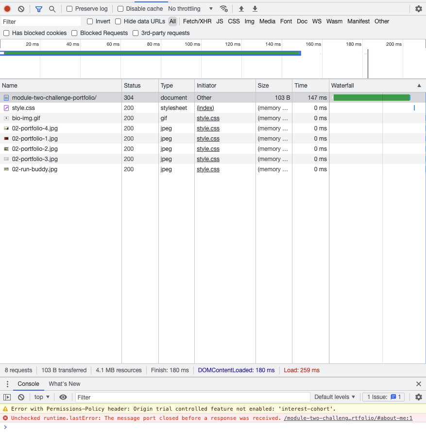
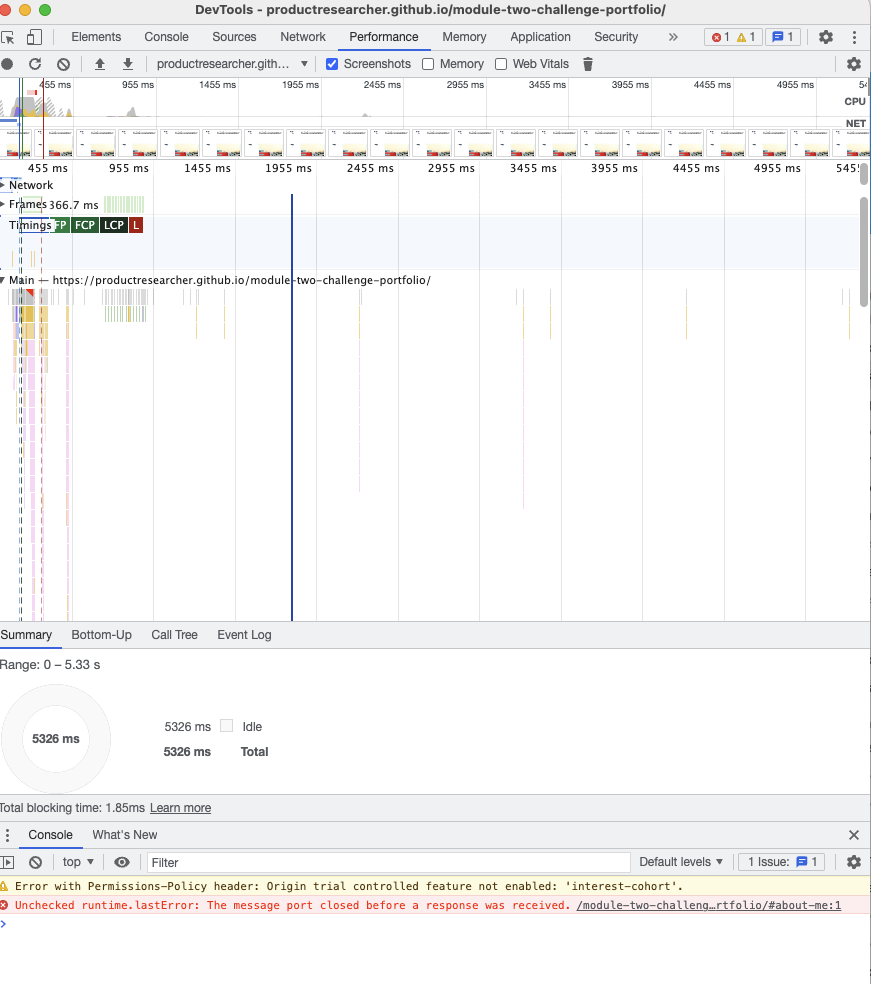

# Module 2 Challenge : Portfolio
 
 What the site looks like:

- - - 
Link to the Live Site
[Module-2-challenge]: https://productresearcher.github.io/module-two-challenge-portfolio/ 

## Description

At the end of module two, I was challenged to create a portfolio-style HTML5 and CSS3 website. 

## Table of Contents

* About the project
* Results
* Tests
* license

#### About the project
The project is designed to test what I learnt during module two training, the challenge was put in a way that I had to use most of the things I learned from the beginning of the course until now.

#### Results
I was able to meet all criteria for the challenge, develop the site and deploy it on GitHub.

## Tests
### Testing simple static website is fairly easy, I focused testing the UI.
#### Test 1: The GUI design:
I compared the reference design with my developed website.
I checked all the sections are presented the same way as the design.

#### Test 2: The fonts.
I checked the font size, font spacing and colour to make sure everything is reproduced as the design. 

#### Test 3: Links.
I checked the links work fine, and looked out for broken links.

#### Test 4: Spelling.
I checked for spelling and grammar errors.

#### Test 5: Images.
I checkd the image links both on the local and remote server.

#### Test 6: Scroll bar.
I checked the scroll bar carefully and to mak sure it all works as expected.

#### Test 7: Errors.
I checked to make sure it is an error free webpage, this includes UI and Console inspecttion.

#### Test 7: Validating with W3 validator.
Corrected all errors that came up in W3 validator.
Made sure it is validated and follows the W3C sttandard, check the error free site result image below.

#### Test 8: Check loading speed using chrome dev tools.
Used network tab to explore opportunitites to improve site performance:

Using performance tab to check performance:

No futher tests reqauired as this is a one page static site.

## Licence

The is an M.I.T licence

---

