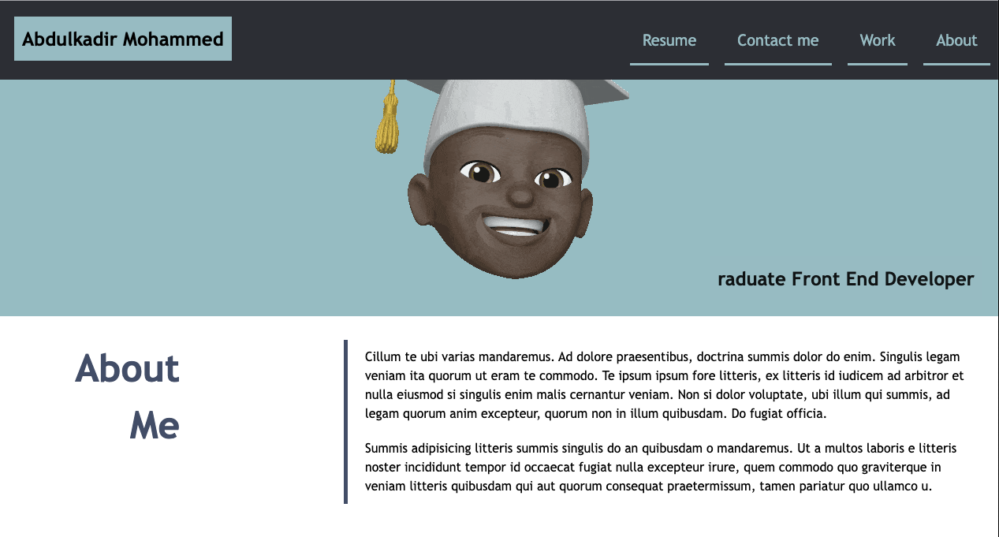

# Module 2 Challenge : Portfolio
 
 What the site looks like:

- - - 
Link to the Live Site
[Module-2-challenge]: https://productresearcher.github.io/module-two-challenge-portfolio/ 

## Description

At the end of my module two, I was challenged to create a portfolio style HTML5 and CSS3 website. 

## Table of Contents

* About the project
* Results
* Tests
* license

#### About the project
The project is designed to test whatt I learnt dring the module two, the challenge was put in a way that I had to use most of the things I learned from the beggining of the course until now.

#### Results
I was able to meet all criteria for the challenge, develop tthe site and deploy it on github.

## Tests

Testt 1: Userbility
Test 2: plugins

## Licence

The is an M.I.T licence

---

